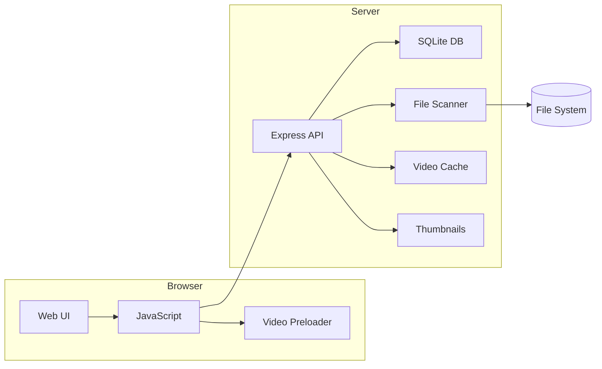

# System Patterns: VODlibrary

## Architecture Overview
Traditional client-server architecture with Node.js backend and web frontend.

## Key Patterns

### Authentication
- Session key-based with HTTP-only cookies
- Middleware protection for all routes except login/assets
- SSE endpoint exempt from auth for pre-login connections

### Data Management
- SQLite database for video metadata
- File system scanning with chokidar monitoring
- Companion JSON files for death timestamps
- Real-time updates via Server-Sent Events

### Performance
- Server-side caching for video segments
- Client-side preloading with debounce
- HTTP caching headers for static assets
- Database indexing for search/sort operations

### Frontend Architecture
- Infinite scroll pagination
- Real-time UI updates via SSE
- GSAP-based smooth scrolling
- LocalStorage for user preferences

## Component Relationships
- **Scanner** → Database (metadata storage)
- **Chokidar** → SSE (real-time updates)
- **Cache** → Video serving (performance)
- **Thumbnail** → Static assets (UI)
